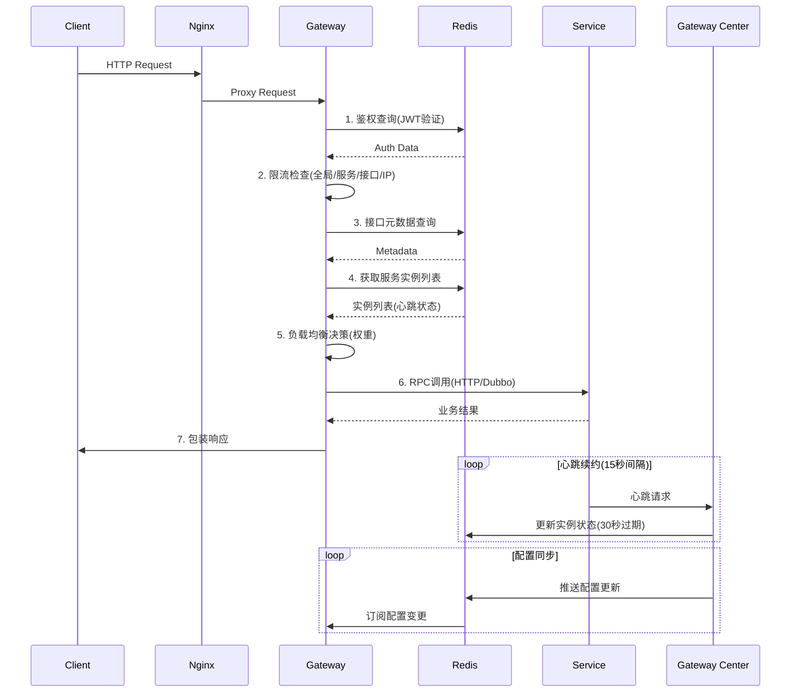

```mermaid
sequenceDiagram
participant C as Client
participant N as Nginx
participant G as Gateway
participant R as Redis
participant S as Service
participant GC as Gateway Center

C->>N: HTTP Request
N->>G: Proxy Request
G->>R: 1. 鉴权查询(JWT验证)
R-->>G: Auth Data
G->>G: 2. 限流检查(全局/服务/接口/IP)
G->>R: 3. 接口元数据查询
R-->>G: Metadata
G->>R: 4. 获取服务实例列表
R-->>G: 实例列表(心跳状态)
G->>G: 5. 负载均衡决策(权重)
G->>S: 6. RPC调用(HTTP/Dubbo)
S-->>G: 业务结果
G->>C: 7. 包装响应
loop 心跳续约(15秒间隔)
S->>GC: 心跳请求
GC->>R: 更新实例状态(30秒过期)
end
loop 配置同步
GC->>R: 推送配置更新
R->>G: 订阅配置变更
end
```

