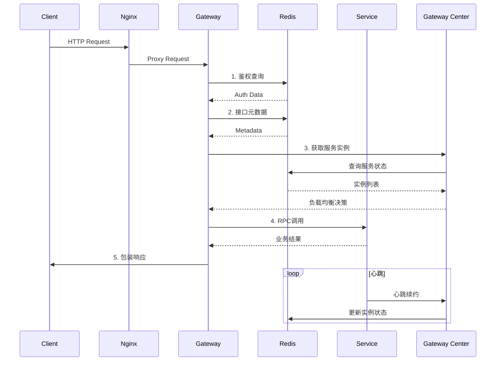

```mermaid
sequenceDiagram
participant C as Client
participant N as Nginx
participant G as Gateway
participant R as Redis
participant S as Service
participant GC as Gateway Center

C->>N: HTTP Request
N->>G: Proxy Request
G->>R: 1. 鉴权查询
R-->>G: Auth Data
G->>R: 2. 接口元数据
R-->>G: Metadata
G->>GC: 3. 获取服务实例
GC->>R: 查询服务状态
R-->>GC: 实例列表
GC-->>G: 负载均衡决策
G->>S: 4. RPC调用
S-->>G: 业务结果
G->>C: 5. 包装响应
loop 心跳
S->>GC: 心跳续约
GC->>R: 更新实例状态
end
```

