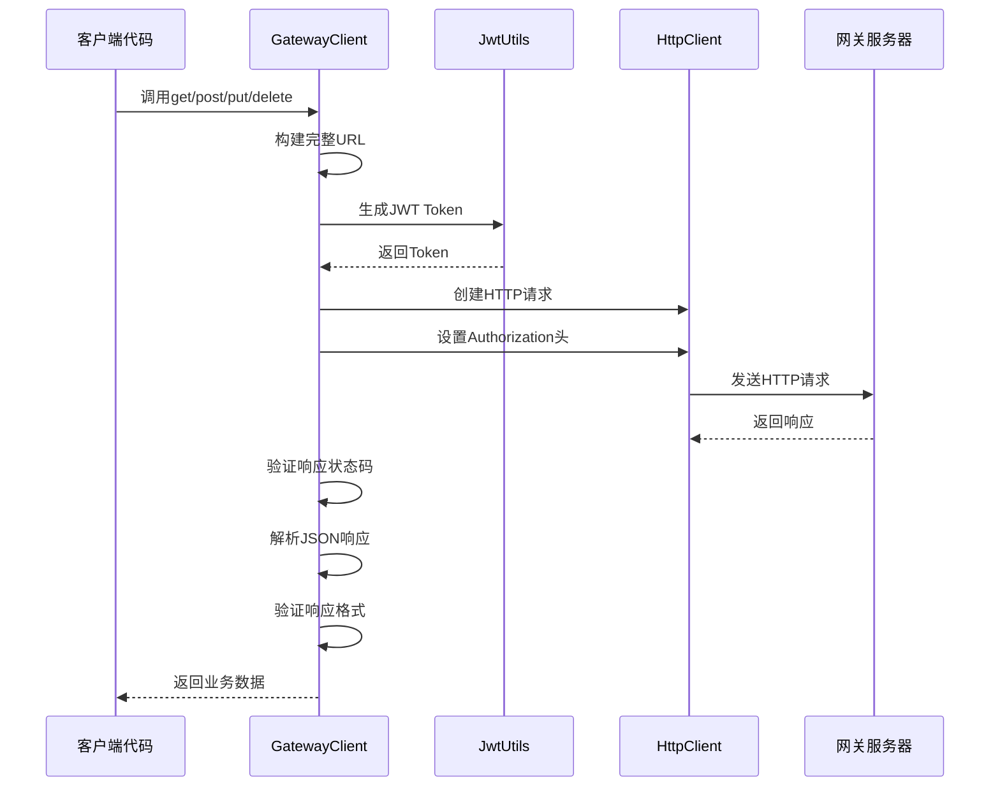
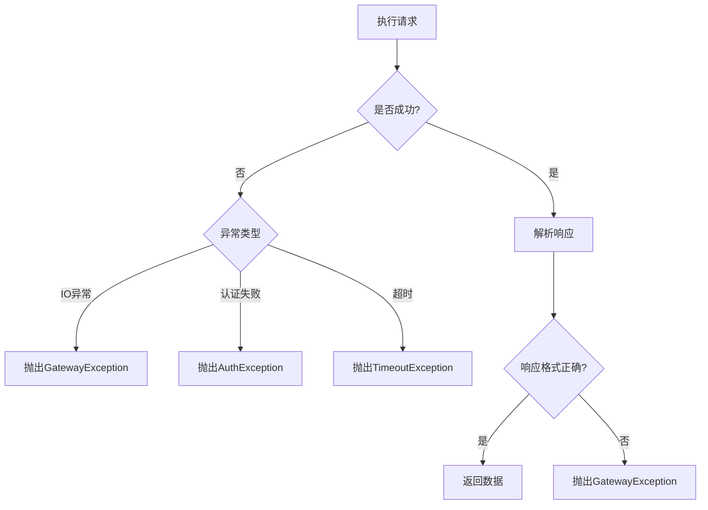

# 详情介绍

## 组件工作逻辑

### 请求处理流程



### 异常处理流程



## 文件详细说明

### 1. GatewayClient

**路径**: `top.codelong.sendsdk.client`

**作用**: 网关客户端核心类，提供HTTP请求API

**关键方法**:

```java
// GET请求
public String get(String path, Map<String, Object> params) throws GatewayException

// POST请求
public String post(String path, Map<String, Object> params, Object body) throws GatewayException

// PUT请求
public String put(String path, Map<String, Object> params, Object body) throws GatewayException

// DELETE请求
public String delete(String path, Map<String, Object> params) throws GatewayException
```

**核心逻辑**:

```java
private String execute(HttpMethod method, String path,
                       Map<String, Object> params, Object body) throws GatewayException {
    // 1. 构建完整URL
    String url = buildUrl(path, params);

    // 2. 创建HTTP请求
    HttpUriRequest request = createRequest(method, url, body);

    // 3. 设置认证头
    setAuthHeader(request);

    // 4. 执行请求
    HttpResponse response = httpClient.execute(request);

    // 5. 处理响应
    return handleResponse(response);
}
```

### 2. GatewaySDKProperties

**路径**: `top.codelong.sendsdk.config`

**作用**: SDK配置属性类，管理网关地址、认证信息等

**配置项**:

```java
@ConfigurationProperties(prefix = "api.gateway.sdk")
public class GatewaySDKProperties {
    private String baseUrl;           // 网关基础URL
    private String safeKey;           // 安全密钥
    private String safeSecret;        // 安全凭证
    private int connectTimeout = 5000;    // 连接超时（毫秒）
    private int socketTimeout = 10000;    // 读取超时（毫秒）
    private int maxConnections = 100;     // 最大连接数
}
```

### 3. JwtUtils

**路径**: `top.codelong.sendsdk.utils`

**作用**: JWT令牌生成工具类

**关键逻辑**:

```java
public String generateToken(String key, String secret) {
    // 1. 设置过期时间（30天）
    Date expireDate = new Date(System.currentTimeMillis() + TOKEN_EXPIRE_TIME);

    // 2. 创建HMAC256算法
    Algorithm algorithm = Algorithm.HMAC256(secret);

    // 3. 构建JWT Token
    return JWT.create()
            .withIssuedAt(new Date())
            .withExpiresAt(expireDate)
            .withClaim("safe-key", key)
            .sign(algorithm);
}
```

**Token特性**:

- 有效期：30天
- 算法：HMAC256
- 包含声明：safe-key（安全密钥）
- 包含签发时间和过期时间

### 4. HttpClientFactory

**路径**: `top.codelong.sendsdk.client`

**作用**: HTTP客户端工厂类，负责创建和配置HttpClient

**关键配置**:

```java
public static CloseableHttpClient createHttpClient(GatewaySDKProperties properties) {
    // 1. 创建连接管理器
    PoolingHttpClientConnectionManager cm = new PoolingHttpClientConnectionManager();
    cm.setMaxTotal(properties.getMaxConnections());
    cm.setDefaultMaxPerRoute(properties.getMaxConnections() / 2);

    // 2. 设置请求配置
    RequestConfig config = RequestConfig.custom()
            .setConnectTimeout(properties.getConnectTimeout())
            .setSocketTimeout(properties.getSocketTimeout())
            .build();

    // 3. 创建HttpClient
    return HttpClients.custom()
            .setConnectionManager(cm)
            .setDefaultRequestConfig(config)
            .evictIdleConnections(60L, TimeUnit.SECONDS)  // 60秒清理空闲连接
            .build();
}
```

**连接池特性**:

- 支持连接复用
- 自动清理空闲连接（60秒）
- 可配置的连接超时和读取超时
- 支持高并发请求

### 5. GatewayAutoConfiguration

**路径**: `top.codelong.sendsdk.config`

**作用**: 自动配置类，创建SDK所需的Bean

**关键配置**:

```java
@Configuration
@EnableConfigurationProperties(GatewaySDKProperties.class)
public class GatewayAutoConfiguration {

    @Bean
    @ConditionalOnMissingBean
    public ObjectMapper objectMapper() {
        return new ObjectMapper();
    }

    @Bean
    @ConditionalOnMissingBean
    public JwtUtils jwtUtils() {
        return new JwtUtils();
    }

    @Bean
    @ConditionalOnMissingBean
    public CloseableHttpClient httpClient(GatewaySDKProperties properties) {
        // 创建HTTP客户端
    }

    @Bean
    @ConditionalOnMissingBean
    public GatewayClient gatewayClient(...) {
        // 创建网关客户端
    }
}
```

### 6. 异常体系

**GatewayException** - 网关异常基类

```java
public class GatewayException extends RuntimeException {
    public GatewayException(String message) {
        super(message);
    }

    public GatewayException(String message, Throwable cause) {
        super(message, cause);
    }
}
```

**AuthException** - 认证异常

```java
public class AuthException extends GatewayException {
    public AuthException(String message) {
        super(message);
    }
}
```

**TimeoutException** - 超时异常

```java
public class TimeoutException extends GatewayException {
    public TimeoutException(String message) {
        super(message);
    }
}
```

### 7. Result

**路径**: `top.codelong.sendsdk.common`

**作用**: 统一响应结果封装类

**数据结构**:

```java
public class Result<T> implements Serializable {
    private Integer code;    // 状态码 (1:成功, 0:失败)
    private String msg;      // 消息
    private T data;          // 业务数据
}
```

**工厂方法**:

```java
// 成功响应
Result.success();
Result.success(data);

// 失败响应
Result.error(msg);
```

## 文件协同工作

### 启动阶段

1. Spring Boot加载`META-INF/spring.factories`中的自动配置
2. `GatewayAutoConfiguration`创建以下Bean：
   - `ObjectMapper`：JSON序列化工具
   - `JwtUtils`：JWT令牌生成器
   - `CloseableHttpClient`：HTTP客户端
   - `GatewayClient`：网关客户端

### 请求阶段

1. 客户端代码调用`GatewayClient`的请求方法
2. `GatewayClient`构建完整URL和HTTP请求
3. `JwtUtils`生成JWT Token并设置到请求头
4. `HttpClient`执行HTTP请求
5. 响应被解析、验证并返回业务数据

### 异常处理

- IO异常 → `GatewayException`
- 认证失败 → `AuthException`
- 超时异常 → `TimeoutException`
- 响应格式错误 → `GatewayException`

## 最佳实践

### 1. 配置管理

```yaml
# 开发环境
api:
  gateway:
    sdk:
      baseUrl: http://localhost:8080
      connectTimeout: 5000
      socketTimeout: 10000
      maxConnections: 50

# 生产环境
api:
  gateway:
    sdk:
      baseUrl: http://gateway.prod.com:8080
      connectTimeout: 3000
      socketTimeout: 5000
      maxConnections: 200
```

### 2. 异常处理

```java
try {
    String result = gatewayClient.get("/api/data", params);
    // 处理结果
} catch (AuthException e) {
    // 认证失败，检查safeKey和safeSecret
    log.error("认证失败: {}", e.getMessage());
} catch (TimeoutException e) {
    // 超时，可能需要增加超时时间
    log.error("请求超时: {}", e.getMessage());
} catch (GatewayException e) {
    // 其他网关异常
    log.error("网关异常: {}", e.getMessage());
}
```

### 3. 参数构建

```java
// 使用Map构建参数
Map<String, Object> params = new HashMap<>();
params.put("page", 1);
params.put("pageSize", 10);
params.put("status", "active");

// 使用对象构建请求体
UserRequest request = new UserRequest();
request.setUsername("admin");
request.setEmail("admin@example.com");

String result = gatewayClient.post("/api/users", null, request);
```

### 4. 响应处理

```java
try {
    String result = gatewayClient.get("/api/users", params);

    // 解析JSON响应
    JSONObject json = new JSONObject(result);
    List<User> users = json.getJSONArray("items")
            .toList()
            .stream()
            .map(item -> JSON.parseObject(item.toString(), User.class))
            .collect(Collectors.toList());

    return users;
} catch (GatewayException e) {
    log.error("获取用户列表失败", e);
    return Collections.emptyList();
}
```

## 性能优化建议

### 1. 连接池优化

```yaml
api:
  gateway:
    sdk:
      maxConnections: 200        # 根据并发量调整
      connectTimeout: 3000       # 减少连接超时
      socketTimeout: 5000        # 减少读取超时
```

### 2. 请求优化

- 复用`GatewayClient`实例（已通过Spring Bean管理）
- 避免频繁创建新的参数Map
- 使用连接池的连接复用

### 3. 异常处理优化

- 区分不同异常类型进行处理
- 实现重试机制（对于超时异常）
- 记录详细的错误日志便于调试

## 常见问题

### 1. 认证失败

**原因**: safeKey或safeSecret配置错误

**解决**: 检查`application.yml`中的配置是否与网关中心一致

### 2. 连接超时

**原因**: 网关服务不可用或网络问题

**解决**:
- 检查网关服务是否正常运行
- 增加`connectTimeout`配置
- 检查网络连接

### 3. 响应格式错误

**原因**: 网关返回的响应格式不符合预期

**解决**:
- 检查网关服务是否正常
- 查看网关日志了解具体错误
- 确保请求路径正确
